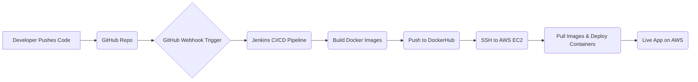

Absolutely! Here's an updated version of your README that reflects your **DevOps skills**, mentioning **AWS EC2**, **Jenkins CI/CD**, **Docker**, and **automatic deployments**.

---

# Weather Management System

## Overview

The **Weather Management System** is a cloud-native web application providing real-time weather information for multiple locations. Users can search for weather data, view current conditions, and get detailed forecasts. This project demonstrates both full-stack development and automated DevOps workflows.

---

## Features

- 🌤️ Real-time weather data retrieval  
- 🖥️ User-friendly interface for searching locations  
- 📈 Display of temperature, humidity, wind speed, and more  
- 🚀 **Automated CI/CD pipeline using Jenkins and Docker**  
- ☁️ **Hosted on AWS EC2 with zero-downtime deployments**

---

## Technologies Used

- **Frontend**: React  
- **Backend**: Node.js, Express  
- **Database**: MongoDB  
- **Containerization**: Docker  
- **CI/CD**: Jenkins  
- **Cloud Hosting**: AWS EC2  

---

## Architecture & DevOps Pipeline 🚀

This project follows a **GitOps** approach with **automated deployments** to AWS infrastructure:

1. **GitHub** → Source code management  
2. **Jenkins** → Automates the CI/CD pipeline  
3. **DockerHub** → Docker images for backend and frontend are pushed here  
4. **AWS EC2 (Ubuntu)** → Hosts the production environment  
5. **Webhook Trigger** → GitHub push automatically triggers Jenkins builds

### 🛠️ CI/CD Pipeline Workflow

- Whenever code is pushed to the **GitHub repository**, a **GitHub webhook** triggers a **Jenkins pipeline**.
- Jenkins pulls the latest code and:
  1. Builds Docker images for **frontend** and **backend**.
  2. Pushes these images to **DockerHub**.
  3. SSHs into the AWS EC2 instance.
  4. Stops and removes any running containers.
  5. Pulls the latest Docker images from DockerHub.
  6. Runs the updated containers, ensuring the latest version is deployed automatically.

---

## Live Deployment 🌍

The application is **live and hosted on AWS EC2**, running in Docker containers.  
- **Backend API Endpoint**: `http://<your-ec2-ip>:5000/api/weather`  
- **Frontend App**: `http://<your-ec2-ip>:3000/`

---

## Prerequisites (For Local Setup)

- **Node.js** (v16 or higher)  
- **MongoDB** (if running locally)  
- **Docker & Docker Compose**  
- **Jenkins** (for CI/CD setup, optional for local)  
- **AWS EC2** (optional for hosting your own deployment)

---

## Local Development & Deployment

### Clone the Repository

```bash
git clone https://github.com/ayushsharma-1/Weather-Management-System.git
cd Weather-Management-System
```

### Running Backend Locally

```bash
cd backend
npm install
node server.js
```

### Running Frontend Locally

```bash
cd frontend
npm install
npm start
```

---

## Running with Docker Locally 🐳

Use Docker Compose to run backend, frontend, and MongoDB services:

```bash
docker-compose up --build
```

Access the app at `http://localhost:3000`.

---

## Docker Images

Pull the latest images directly from DockerHub:

- **Backend** → [ayush180/weather-backend](https://hub.docker.com/repository/docker/ayush180/weather-backend)  
- **Frontend** → [ayush180/weather-frontend](https://hub.docker.com/repository/docker/ayush180/weather-frontend)

---

## DevOps Workflow Demo 🚀  
> **Automated CI/CD with Jenkins + Docker + AWS EC2**

- GitHub push triggers Jenkins pipeline.
- Jenkins builds & pushes Docker images to DockerHub.
- AWS EC2 pulls the latest Docker images and runs them in containers.
- No manual intervention required for deployment!
  
Pipeline steps:
```yaml
- Checkout GitHub repo
- Build backend & frontend Docker images
- Push images to DockerHub
- SSH into AWS EC2
- Stop running containers
- Pull latest Docker images
- Run updated containers
```

---

## CI/CD Pipeline Diagram


---

## Contributing

Contributions are welcome!  
Feel free to **fork** the repo, create **pull requests**, or open **issues**.

---

## License

This project is licensed under the MIT License.

---

### Author  
👤 **Ayush Sharma**  
- GitHub: [ayushsharma-1](https://github.com/ayushsharma-1)

---

Let me know if you want to include screenshots, badges, or status indicators (e.g., build passing ✅) on top!  
Want me to add a section on monitoring/logging (CloudWatch, Prometheus) or scaling with ECS/Auto Scaling Groups?
